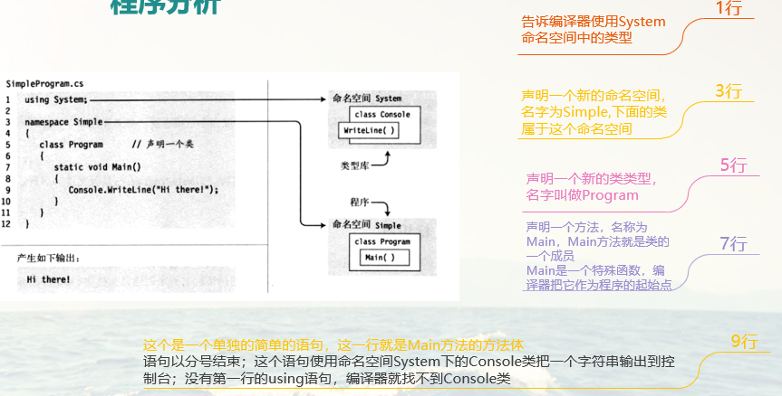

# C#初级教程

## C#和.net框架

### 微软平台的编程

> ①、编程语言使用Visual Basic C C++
>
> ②、20世纪90年代末
>
> ​        Win32API MFC COM（组件对象模型）
>
> ③、2002
>
> ​        发布第一个.NET框架（多平台，行业标准，安全性）

### .NET框架

### BCL（Base Class Library基类库）

BCL包括：

- 通用基础类 - 文件操作，字符串操作……
- 集合类 - 列表，字典……
- 线程和同步类 - 多线程程序
- XML类 - 创建，读取以及操作XML文档

### 编译过程

### 运行过程

### 编译和运行过程

### CLR概览

### C#的演化

## 进入C#编程

### 程序分析

### 计算机使用基本知识

- 常用快捷键  

  Home/End/PageUp/PageDown

   Shift

   Ctrl + A,S,Z,X,C,V,Home,End

   F5/Ctrl+F5

- 文字的删除 

  Del/Backspace

- 插入模式和覆盖模式

- 全角字符和半角字符 英文字符和中文字符

### 标示符

### C#命名规范

- Camel命名法

   首个单词的首字母小写，其余单词的首字母大写(enemyHp)

- Pascal命名规范

   每个单词的第一个字母都大写(EnemyHp)

   如果使用到英文单词的缩写，全部使用大写(PI HP MP)

- 变量使用Camel命名，方法和类使用Pascal命名规范

### C#关键字

### Main方法

每个C#程序必须带一个Main方法（函数）

### 语句

语句是描述一个类型或告诉程序去执行某个动作的一条源代码指令，语句以分号结束。

int var1 = 5;

System.Console.WriteLine("The value of var1 is {0}",var1);

### 块

### 从程序中输出文本

控制台窗口是一个简单的命令提示窗口，允许程序显示文本并从键盘接受输入。BCL提供一个Console的类（在System命名空间下）,该类包含了输入和输出到控制台窗口的方法。

- **Write：**

  Write是Console类的成员，它把一个文本字符串发送到程序的控制台窗口。最简单的使用，Write把文本的字符串字面量发送到窗口，字符串必须使用双引号括起来。实例：

  Console.Write("This is a trivial text.");

  

- **WriteLine：**

  WriteLine是Console的另外一个成员，它和Write实现相同的功能，但会在每个输出字符串的结尾添加一个换行符。

  System.Console.WriteLine("Hello world1.");

  System.Console.WriteLine("Hello world2.");

  System.Console.WriteLine("Hello world3.");

### 格式化字符串

当利用Write和WriteLine方法输出的时候，可以对字符串进行格式化输出，什么是格式化输出呢？

Console.WriteLine("两个数相加{0}+{1}={2}",3,34,34);

### 多重标记和值

下面的语句使用了3个标记，但只有两个值

Console.WriteLine("Three integers are {1},{0} and {1}",3,5);

但是记住标记不能引用超出替换值列表长度以外位置的值

## 变量和表达式

### 变量

#### 为什么使用变量

计算机程序的运行其实就是对数据的操作，数据是什么？比如数字，文字，图片这些在计算机中都是数据，那么数据怎么在计算机中存储呢？

答案：通过变量。你可以把计算机内存中的变量，当成一个盒子，盒子里面存储着东西，可以放入或者取出

#### 变量的声明

声明变量需要指定类型和变量名

<type> <name>;

type表示使用什么类型的盒子，来存储数据

name表示存储这个盒子的名字

实例:(每一个声明都是一条语句，语句以；结束)

​		 int age;

​		 int hp;

​		 string name;

### 简单类型

#### 简单类型-整数

#### 简单类型-小数

#### 简单类型-非数值类型

