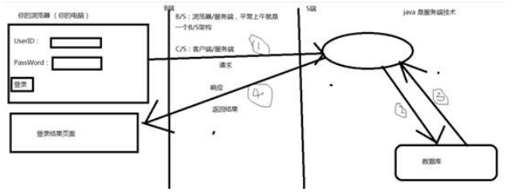
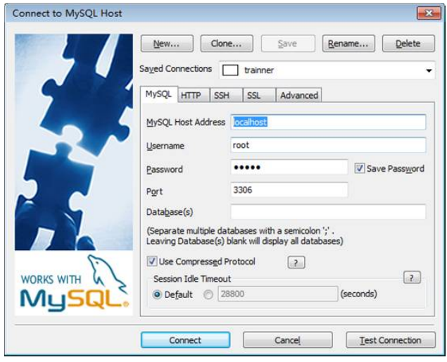
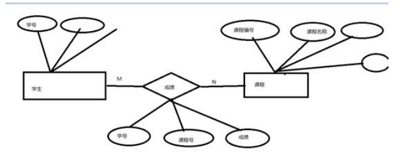
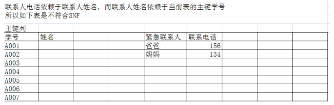
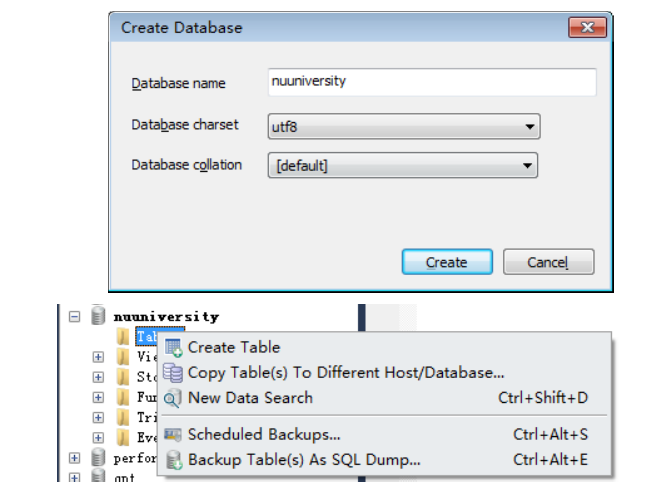
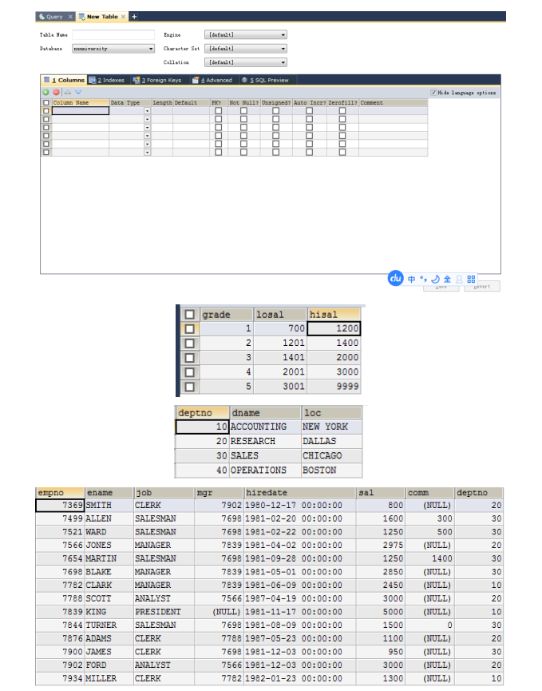
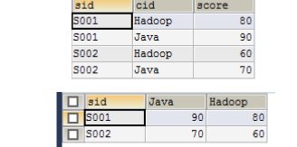

 

## 本次课程设计的主要技术

1、Web前端技术：HTML、CSS、JavaScript、JQuery、JSON、Ajax、Bootstrap....

2、数据库：MySQL

3、服务器端技术：Java、JDBC（C3P0链接池）、Servlet、JSP

 

## MySQL

数据库管理系统（数据库），实际上是一个专门用于管理大量数据来用的软件。

SQLYog启动

 

 

 

数据库的相关步骤

### 画E-R图：

①、实体：长方形

②、属性：椭圆

③、无向线：关联实体和属性，

④、比例关系：1:1  1：n  M：N关系

⑤、实体与实体之间的关系：菱形

 

### 范式：

①、第一范式：1NF：没有重复的列

②、第二范式：2NF：没有重复的行数据， 每个表必须有主键

③、第三范式：3NF：没有传递依赖于主键的列，就符合3NF。

 

### SQL

SQL是所有的关系型数据库都要准守的一个工业标准，结构化查询语言，专门对关系数据库中的对象以及数据进行操作

关系型数据库：MySQL、Oracle、MS-SQLServer。还有其他的小众数据库如SyBase、DB2

> ①、DDL：数据库对象操作语言：操作数据库对象。。比如表就是一个数据库对象，所以创建表用DDL
>
> 完成表中的数据的操作主要就是如下几个方面：新增、删除、修改、检索（CURD操作）
>
> **②、DML：数据操作语言：**用于完成对表中数据的插入（新增）、删除、修改
>
> **③、DQL：数据查询语言：**完成数据检索用的，将数据按照需求从表中检索出来一个结果
>
> 

#### DDL&DML：

数据库对象操作语言：

> ①、新增表（创建表）：create table tblName（列名1 数据类型，列名2 数据类型,....列名n 数据类型）；
>
> 数据类型：整数int、小数float|double、字符串varchar、日期时间datetime
>
> 约束：
>
> 主键约束  primary key
>
> ~~~ sql
> -- create table 表名（列名1 数据类型，列名2 数据类型,....列名n 数据类型）；
> 
> -- 删除表
> DROP TABLE student;
> 
> -- 创建表 DDL
> CREATE TABLE student(
> stuno INT PRIMARY KEY,
> stuname VARCHAR(30),
> stuaddress VARCHAR(100));
> 
> 
> -- DML ：新增数据
> -- 语法：insert into 表名(列名列表) values(值列表)
> INSERT INTO student(stuno,stuname,stuaddress) 
> VALUES(1,'刘备','三国');
> 
> -- DQL：查看表中的所有列数据
> SELECT * FROM student;
> 
> 
> -- 实验：创建一个email表，其中有发件人姓名，邮件的标题，邮件的内容
> CREATE TABLE email(
> fromname VARCHAR(30),
> title VARCHAR(200),
> body VARCHAR(500)
> );
> ~~~
>
> DML：insert  ,delete，update
>
> insert插入数据：
>
> 语法1：insert into 表名(列名列表) values(值列表)；可以向表中指定列插入数据
>
> 语法2：insert into 表名 values(值列表)：必须向表中所有列都插入数据
>
> ~~~sql
> 语法1：INSERT INTO 表名(列名列表) VALUES(值列表):
> INSERT INTO email(fromname,title,body) VALUES('刘备','你还好吗，来三国杀啊','小样，听说你三国杀玩的不错');
> INSERT INTO email(fromname,title) VALUES('刘备','你还好吗，来三国杀啊');
> 语法2：INSERT INTO 表名 VALUES(值列表)
> INSERT INTO email VALUES('关羽','来三国啊','ok');
> ~~~
>
> delete删除数据：
>
> ~~~ sql
> -- 删除数据：delete from 表名  where 条件。。。。删除数据是以行为基本单位操作的
> DELETE FROM email WHERE fromname='关羽';
> DELETE FROM email WHERE fromname='刘备';
> ~~~
>
> update 更新数据：
>
> ~~~ sql
> -- 更新数据：update 表名 set 列名=新值 [where 条件]
> UPDATE email SET body ='哈哈哈哈';
> UPDATE email SET body='嗯嗯嗯嗯嗯' WHERE fromname='关羽'
> ~~~
>
> 
>
> 

SQLYog：创建数据库

~~~ sql
CREATE TABLE DEPT
(
  deptno INT PRIMARY KEY,
  dname  VARCHAR(50),
  loc    VARCHAR(50)
);

CREATE TABLE EMP
(
  empno    INT PRIMARY KEY,
  ename    VARCHAR(50),
  job      VARCHAR(50),
  mgr      INT ,
  hiredate DATETIME,
  sal      FLOAT,
  comm     FLOAT,
  deptno   INT
);

CREATE TABLE SALGRADE
(
  grade INT PRIMARY KEY,
  losal INT,
  hisal INT
);
INSERT INTO DEPT (deptno, dname, loc)VALUES (10, 'ACCOUNTING', 'NEW YORK');
INSERT INTO DEPT (deptno, dname, loc)VALUES (20, 'RESEARCH', 'DALLAS');
INSERT INTO DEPT (deptno, dname, loc)VALUES (30, 'SALES', 'CHICAGO');
INSERT INTO DEPT (deptno, dname, loc)VALUES (40, 'OPERATIONS', 'BOSTON');

INSERT INTO emp (empno, ename, job, mgr, hiredate, sal, comm, deptno) VALUES (7369, 'SMITH', 'CLERK', 7902, '1980-12-17', 800, NULL, 20);
INSERT INTO emp (empno, ename, job, mgr, hiredate, sal, comm, deptno) VALUES (7499, 'ALLEN', 'SALESMAN', 7698, '1981-02-20', 1600, 300, 30);
INSERT INTO emp (empno, ename, job, mgr, hiredate, sal, comm, deptno) VALUES (7521, 'WARD', 'SALESMAN', 7698, '1981-02-22', 1250, 500, 30);
INSERT INTO emp (empno, ename, job, mgr, hiredate, sal, comm, deptno) VALUES (7566, 'JONES', 'MANAGER', 7839, '1981-04-02', 2975, NULL, 20);
INSERT INTO emp (empno, ename, job, mgr, hiredate, sal, comm, deptno) VALUES (7654, 'MARTIN', 'SALESMAN', 7698, '1981-09-28', 1250, 1400, 30);
INSERT INTO emp (empno, ename, job, mgr, hiredate, sal, comm, deptno) VALUES (7698, 'BLAKE', 'MANAGER', 7839, '1981-05-01', 2850, NULL, 30);
INSERT INTO emp (empno, ename, job, mgr, hiredate, sal, comm, deptno) VALUES (7782, 'CLARK', 'MANAGER', 7839, '1981-06-09', 2450, NULL, 10);
INSERT INTO emp (empno, ename, job, mgr, hiredate, sal, comm, deptno) VALUES (7788, 'SCOTT', 'ANALYST', 7566, '1987-04-19', 3000, NULL, 20);
INSERT INTO emp (empno, ename, job, mgr, hiredate, sal, comm, deptno) VALUES (7839, 'KING', 'PRESIDENT', NULL, '1981-11-17', 5000, NULL, 10);
INSERT INTO emp (empno, ename, job, mgr, hiredate, sal, comm, deptno) VALUES (7844, 'TURNER', 'SALESMAN', 7698, '1981-08-09', 1500, 0, 30);
INSERT INTO emp (empno, ename, job, mgr, hiredate, sal, comm, deptno) VALUES (7876, 'ADAMS', 'CLERK', 7788, '1987-05-23', 1100, NULL, 20);
INSERT INTO emp (empno, ename, job, mgr, hiredate, sal, comm, deptno) VALUES (7900, 'JAMES', 'CLERK', 7698, '1981-12-03', 950, NULL, 30);
INSERT INTO emp (empno, ename, job, mgr, hiredate, sal, comm, deptno) VALUES (7902, 'FORD', 'ANALYST', 7566, '1981-12-03', 3000, NULL, 20);
INSERT INTO emp (empno, ename, job, mgr, hiredate, sal, comm, deptno) VALUES (7934, 'MILLER', 'CLERK', 7782, '1982-01-23', 1300, NULL, 10);

INSERT INTO salgrade (grade, losal, hisal)VALUES (1, 700, 1200);
INSERT INTO salgrade (grade, losal, hisal)VALUES (2, 1201, 1400);
INSERT INTO salgrade (grade, losal, hisal)VALUES (3, 1401, 2000);
INSERT INTO salgrade (grade, losal, hisal)VALUES (4, 2001, 3000);
INSERT INTO salgrade (grade, losal, hisal)VALUES (5, 3001, 9999);

~~~

#### DQL，数据检索

基本的语法：select 列名列表 from 表名

~~~ sql
SELECT fromname,title,body FROM email;
SELECT 后面是你要检索的数据所在列的列名。若有多个列，那么用逗号分割
SELECT title,body FROM email;
SELECT * FROM email;  -- *通配了所有列的列名
~~~

> ①、单条件检索
> ②、多条件检索
>
> > and：并且  和  的关系  要求两个条件都必须满足
> >
> > or：或者的关系，两个条件满足一个即可
> >
> > ~~~ sql
> > -- 三国有哪些学生？
> > SELECT * FROM student WHERE stuaddress='三国'
> > -- 三国有哪些男生？
> > SELECT * FROM student WHERE stuaddress='三国' AND sex='男'
> > -- 三国和四国有哪些学生是男的？
> > -- 三国和四国有哪些学生？
> > SELECT * FROM student WHERE stuaddress='三国' OR stuaddress='四国';
> > 
> > ~~~
>
> ③、非空检索
>
> ~~~ sql
> -- 非空检索
> SELECT * FROM student WHERE sex IS NOT NULL;-- 非空
> SELECT * FROM student WHERE sex IS NULL;--是空的
> ~~~
>
> ④、排序检索，将检索出来的结果按照某种要求进行数据的排序
>
> order  by 列名 ASC|DESC
>
> ASC：升序
>
> DESC：降序   
>
> 默认是升序
>
> ~~~sql
> -- 排序检索
> SELECT * FROM student ORDER BY stuno DESC;
> ~~~
>
> 
>
> ⑤、区间检索：between  数1 and 数2
>
> ~~~ sql
> -- 区间检索
> SELECT * FROM news WHERE newsid=170 OR newsid=171 OR newsid=172 ...newsid=179;
> SELECT * FROM news WHERE newsid BETWEEN 170 AND 179;
> ~~~
>
> ⑥、聚合操作：利用mysql支持的函数完成数据的汇总（最大，最小，平均，个数，求和）
>
> ~~~ sql
> -- 需求：计算每个部门的平均薪资是多少？
> -- 需求：咱们公司员工的平均薪资是多少？
> SELECT AVG(sal) FROM emp;-- 平均工资
> SELECT MAX(sal) FROM emp;-- 最高工资
> SELECT MIN(sal) FROM emp;-- 最低工资
> SELECT SUM(sal) FROM emp;-- 工资总额
> SELECT COUNT(empno) FROM emp;-- 多少名员工
> ~~~
>
> ⑦、分组检索：根据某个类的数据是否是相等作为一个组，然后对组内的某个列进行聚合操作。
>
> ~~~ sql
> -- 需求：哪些部门平均工资高于2000
> 分析：
> 1、把每个部门的平均工资计算出来
> SELECT AVG(sal),deptno FROM emp GROUP BY deptno;
> 2、看看计算出来的结果是否超过2000 （分组聚合之后的数据+条件需要用HAVING)
> SELECT AVG(sal),deptno FROM emp GROUP BY deptno HAVING AVG(sal)>2000;
> SELECT AVG(sal) avgsal,deptno FROM emp GROUP BY deptno HAVING avgsal>2000;
> -- 除了有奖金之外的员工中，每个部门平均工资超过2000的有哪些？
> SELECT * FROM emp WHERE comm IS NULL;
> SELECT AVG(sal) avgsal,deptno FROM emp WHERE comm IS NULL GROUP BY deptno HAVING avgsal>2000;
> -- 每个管理者的直接下属有几个？
> SELECT mgr,COUNT(empno) FROM emp GROUP BY mgr;
> 
> ~~~
>
> 注意：在分组检索中，select后面的要么是分组列，要么是聚合类，不允许出现其他的列名
>
> SELECT AVG(sal),deptno,ename FROM emp GROUP BY deptno;  中不允许出现ename；
>
> ⑧、模糊检索：like，利用通配符，%和_进行检索
>
> ~~~ sql
> -- 需求：检索所有以S开头的用户的信息,% 0个或多个任意字符   _一个任意字符
> SELECT * FROM emp WHERE ename LIKE 'S%'
> SELECT * FROM emp WHERE ename LIKE '_A%'
> ~~~
>
> ⑨、多表链接查询：也是项目开发过程中非常常见的一种数据检索方式
>
> > Ⅰ 、等值链接检索，利用两张表中的共工列关联在一起
> >
> > ~~~ sql
> > -- 每个员工的办公地点在哪里？
> > SELECT a.ename,a.empno,a.deptno ,b.loc FROM emp a,dept b WHERE a.`deptno`=b.`deptno`
> > 
> > 
> > ~~~
> >
> > Ⅱ、子查询方式：将一个查询的结果作为另一个查询的条件
> >
> > ~~~ sql
> > -- 需求：哪些员工的工资高于平均工资
> > 分析：
> > 1、确定平均工资是多少
> > SELECT AVG(sal) FROM emp;
> > 2、用每个人的工资和平均工资比较
> > SELECT * FROM emp WHERE sal>平均工资；
> > SELECT * FROM emp WHERE sal>3000;
> > SELECT * FROM emp WHERE sal>(SELECT AVG(sal) FROM emp);
> > ~~~
> >
> > Ⅲ、自链接查询，一张表，但是你把他当成两张表进行检索
> >
> > ~~~ sql
> > -- 需求： 检索每个员工的工号、姓名、直属领导的姓名
> > SELECT a.empno,a.ename,b.empno,b.ename FROM emp a,emp b WHERE a.mgr=b.empno;
> > ~~~
> >
> > Ⅳ、内连接检索，和等值链接一样，但是属于另一种链接方式
> >
> > ~~~ sql
> > -- 每个员工的办公地点在哪里？
> > SELECT a.empno,a.ename,b.loc FROM emp a INNER JOIN dept b ON a.deptno=b.deptno;
> > -- 注意：内链接可以省略inner这个关键字
> > SELECT a.empno,a.ename,b.loc FROM emp a JOIN dept b ON a.deptno=b.deptno;
> > ~~~
> >
> > Ⅴ、左外链接：将左表中的所有行数据以及右表中的对应数据检索出来，以左表为主，右表为辅
> >
> > ~~~sql
> > SELECT * FROM dept a LEFT JOIN emp b ON a.deptno=b.deptno;
> > SELECT a.empno,a.ename,b.dname,b.loc FROM emp a LEFT JOIN dept b ON a.deptno=b.deptno;
> > ~~~
> >
> > Ⅵ、右外链接：和左外都一样，只不过是以右表为主，左表为辅，右表中的所有记录以及左表中的对应记录检出出来
> >
> > ~~~ sql
> > SELECT * FROM dept a LEFT JOIN emp b ON a.deptno=b.deptno WHERE b.sal>2500 ;
> > SELECT * FROM dept a RIGHT JOIN emp b ON a.deptno=b.deptno ;
> > ~~~
> >
> > 
> >
> > Ⅶ、交叉链接：两张表中的每一行做一次组合
> >
> > ~~~ sql
> > SELECT * FROM emp CROSS JOIN dept ;
> > ~~~
> >
> > 

作业：

练习1、请查询表DEPT中所有部门的情况。

练习2、查询表DEPT中的部门号、部门名称两个字段的所有信息。

练习3、请从表EMP中查询10号部门工作的雇员姓名和工资。

练习4、请从表EMP中查找工种是职员CLERK或经理MANAGER的雇员姓名、工资。

练习5、请在EMP表中查找部门号在10－30之间的雇员的姓名、部门号、工资、工作。

练习6、请从表EMP中查找姓名以J开头所有雇员的姓名、工资、职位。

练习7、请从表EMP中查找工资低于2000的雇员的姓名、工作、工资，并按工资降序排列。

练习8、请从表中查询工作是CLERK的所有人的姓名、工资、部门号、部门名称以及部门地址的信息。

练习9、查询表EMP中所有的工资大于等于2000的雇员姓名和他的经理的名字。

练习10、在表EMP中查询所有工资高于JONES的所有雇员姓名、工作和工资。

练习11、列出没有对应部门表信息的所有雇员的姓名、工作以及部门号。

练习12、查找工资在1000～3000之间的雇员所在部门的所有人员信息

练习13、雇员中谁的工资最高。

练习14、复制一张表 要求表结构和数据与员工表一致

练习15、年底发奖金，按照如下工作性质进行奖金发放，请计算每个员工的年底奖金（提示：case when then end 完成）

 job='MANAGER'   ->sal*1.2
 job='SALESMAN' -> sal*1.1
 job='ANALYST' -> sal*0.9
 job='CLERK' -> sal*1.3
 job='PRESIDENT' -> sal*0.7

~~~ sql
-- 检索所有员工信息，
-- 若是10号部门 显示 研发部  20号 显示市场部  30 显示行政部 40显示人事部
SELECT empno,ename,job,mgr,hiredate,sal,comm,
CASE 
 WHEN deptno=10 THEN '研发部' 
 WHEN deptno=20 THEN '市场部'
 WHEN deptno=30 THEN '行政部' 
 WHEN deptno=40 THEN '人事部' 
 ELSE '没有部门'
END 部门名称,deptno
FROM emp;

~~~

练习16：行专列的需求

注意：在sql中，我们经常会将一个结果集作为一个表来继续对其进行检索

~~~sql
SELECT * FROM (SELECT * FROM emp WHERE deptno=30) a WHERE a.sal<2000;
~~~

