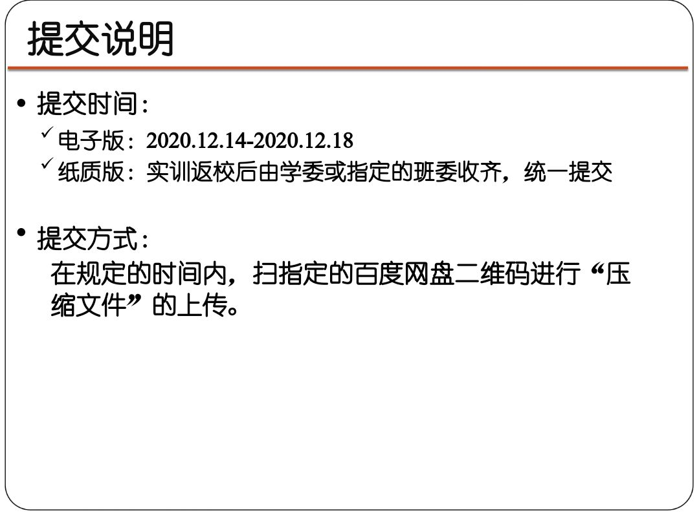

###### 写在前面：

​		本文是我在完成web大作业时的学习笔记。通过了解作业要求，我决定选择了跟随b站的教程来完成这个仿小米商城的前端实战项目。

​		教程链接：

[ html+css+js实战项目 仿小米商城]: https://www.bilibili.com/video/BV1yp4y1a7jU/?spm_id_from=333.788.recommend_more_video.0

​		作业要求：

